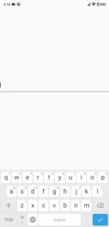

# rich_text_controller

An extended text editing controller that supports different inline styles for custom regex

## Getting Started

### 1. Depend on it

Add this to your package's pubspec.yaml file:

```
dependencies:
  rich_text_controller: [latest version]
```

### 2. Install it

```
$ flutter pub get
```

### 3. Import it

```dart
import'rich_text_controller/rich_text_controller.dart';
```

## Example



.
.

```dart
import 'package:flutter/material.dart';
import 'rich_text_controller/rich_text_controller.dart';

void main() => runApp(MyApp());

class MyApp extends StatelessWidget {
  @override
  Widget build(BuildContext context) {
    return MaterialApp(
      title: 'RichText Controller Demo',
      theme: ThemeData(
        primarySwatch: Colors.blue,
      ),
      home: RichTextControllerDemo(),
    );
  }
}

class RichTextControllerDemo extends StatefulWidget {
  @override
  _RichTextControllerDemoState createState() => _RichTextControllerDemoState();
}

class _RichTextControllerDemoState extends State<RichTextControllerDemo> {

// Add a controller
RichTextController _controller;

  @override
  void initState() {
      // initialize with your custom regex patterns and styles
      _controller = RichTextController({
           //
          //* Returns every Hashtag with red color
          //
          RegExp(r"\B#[a-zA-Z0-9]+\b"):TextStyle(color:Colors.red),
         // add as many expressions as you need!

         //! starting v1.1.0
         // Now you have an onMatch callback that gives you access to a List<String>
         // which contains all matched strings
         onMatch: (List<String> matches){
           // Do something with matches.
           //! P.S
           // as long as you're typing, the controller will keep updating the list.
         }
         //!
      });
    super.initState();
  }
}
```

### Assertions

- Must not add both stringMap and patternMap, only one of them.

## Contributing

Contributing is more than welcomed on any of my packages/plugins.
I will try to keep adding suggested features as i go.

**Current list of contributors:**

- EriKWDev

## Versioning

- **V1.0.0** - First Release.
- **V1.0.1** - Added Example.
- **V1.1.0** - Added onMatch Callback.
- **V1.2.0** - Resolved Issues + added String-Matching.
- **V1.3.0** - Resolved Issues + added Null safety.

## Authors

**Michael Aziz** - [Github](https://github.com/micwaziz)

## License

This project is licensed under the MIT License - see the [LICENSE.md](LICENSE.md) file for details
